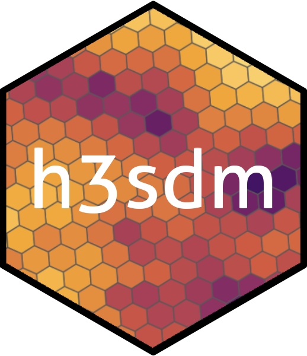

<!-- README.md is generated from README.Rmd. Please edit that file -->

```{r, include = FALSE}
knitr::opts_chunk$set(
  collapse = TRUE,
  comment = "#>",
  fig.path = "man/figures/README-",
  out.width = "100%"
)
```

```{r hexsticker, echo=FALSE, out.width="20%", fig.align="right"}

```

# h3sdm

<!-- badges: start -->
<!-- badges: end -->

The goal of h3sdm is to ...

## Installation

You can install the development version of h3sdm from [GitHub](https://github.com/) with:

``` r
# install.packages("pak")
pak::pak("ManuelSpinola/h3sdm")
```

## Example

This is a basic example which shows you how to solve a common problem:

```{r example}
library(h3sdm)
## basic example code
```


