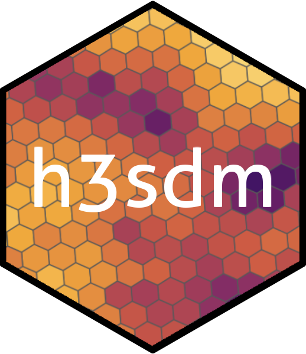

<!-- README.md is generated from README.Rmd. Please edit that file -->

<div style="display: flex; align-items: center;">



<h1>

h3sdm
</h1>

</div>

**h3sdm**: Machine Learnig based species distribution modeling with H3
spatial grids.

# h3sdm

<!-- badges: start -->

<!-- badges: end -->

The goal of h3sdm is to …

## Installation

You can install the development version of h3sdm from
[GitHub](https://github.com/) with:

``` r
# install.packages("pak")
pak::pak("ManuelSpinola/h3sdm")
```

## Example

This is a basic example which shows you how to solve a common problem:

``` r
library(h3sdm)
## basic example code
```
