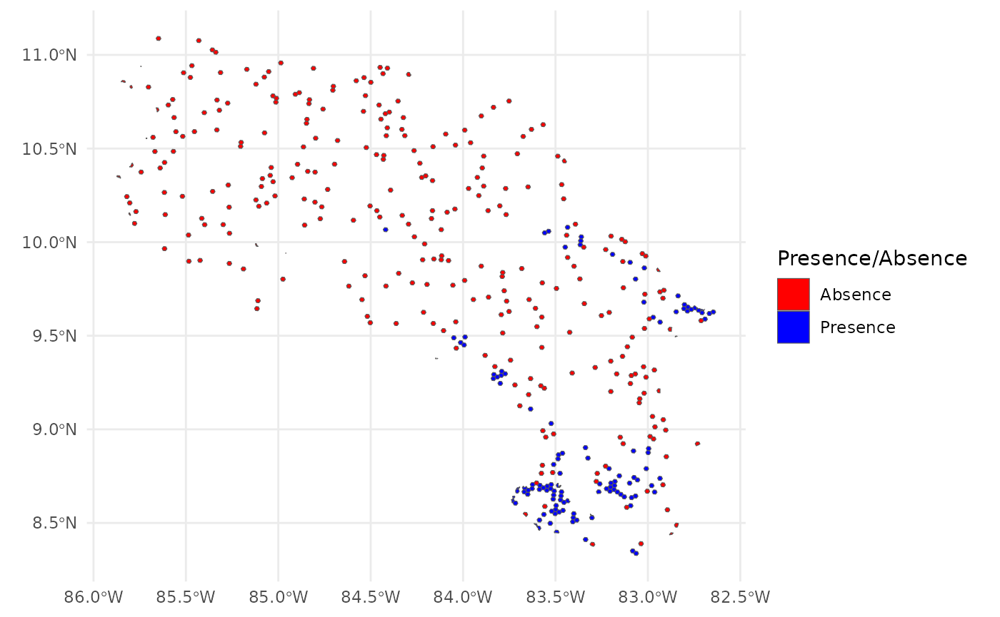
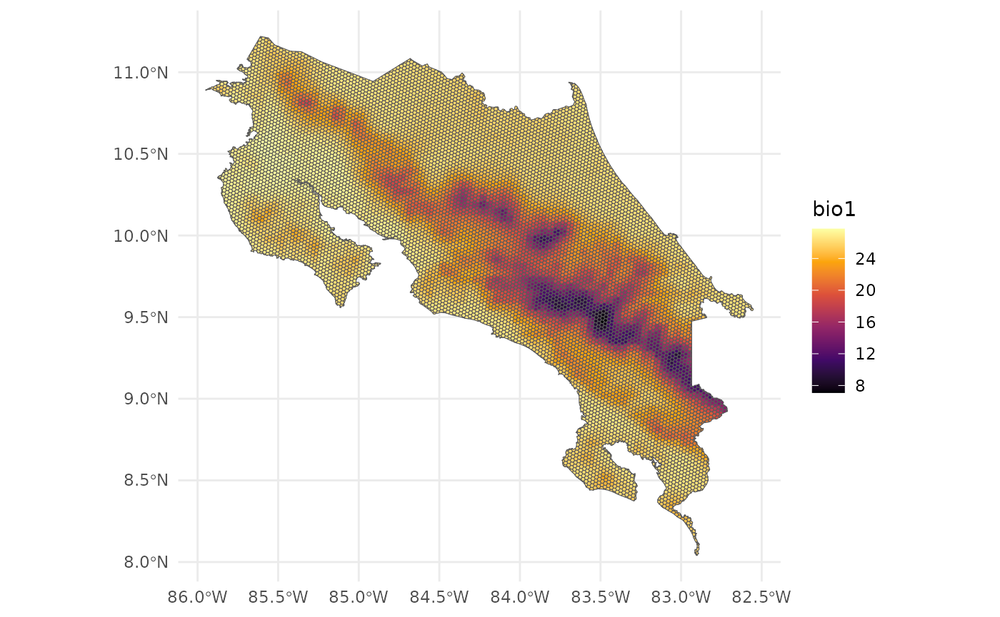
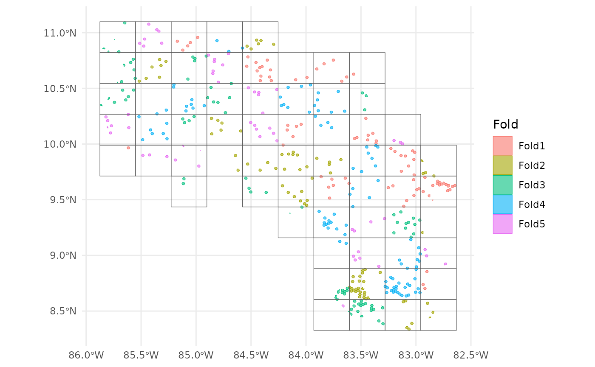
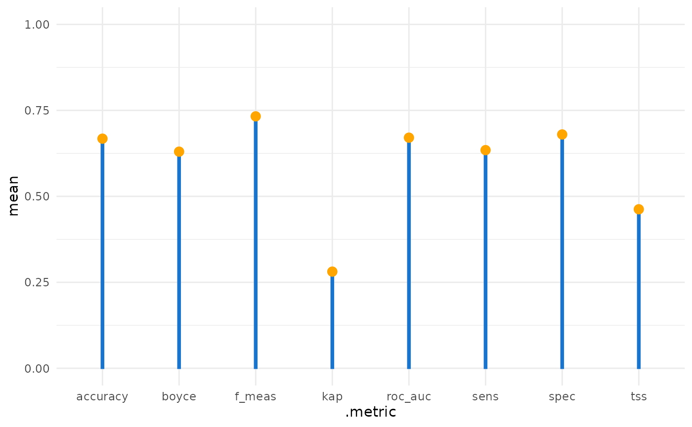
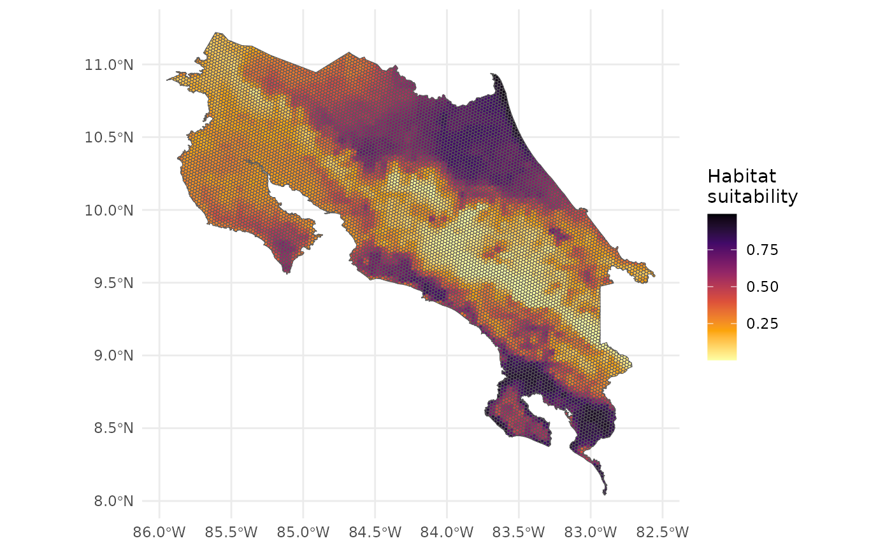
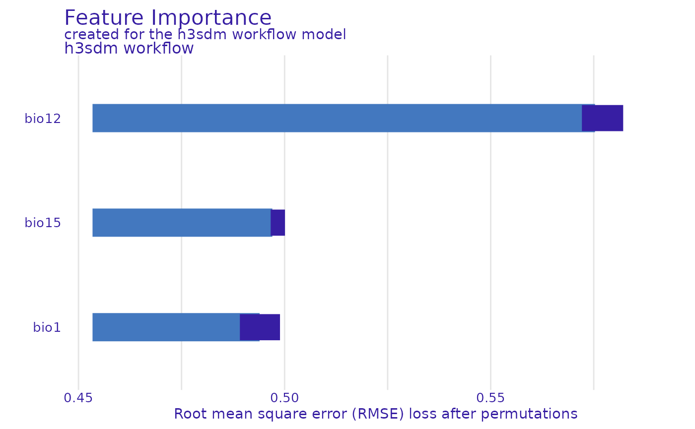
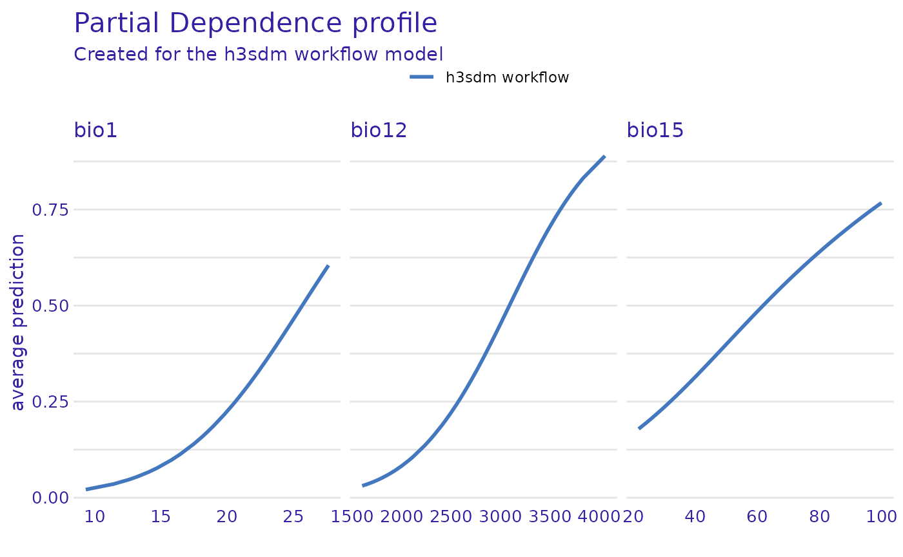
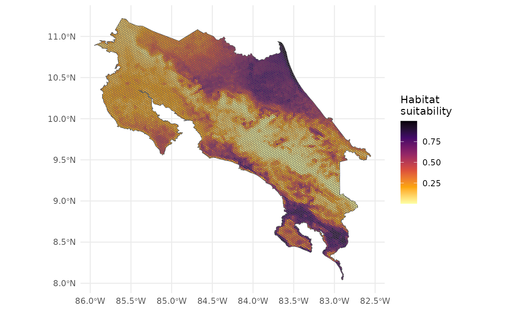

# h3sdm workflow for a single model

## Introduction

This vignette demonstrates a complete workflow for species distribution
modeling (SDM) for a single species using `h3sdm`. We cover data
preparation, model fitting, spatial cross-validation, prediction, and
feature importance.

## Load packages

``` r
library(h3sdm)
library(sf)
library(terra)
library(dplyr)
library(ggplot2)
library(tidymodels)
library(spatialsample)
library(DALEX)
library(themis)
```

## 1. Define the Area of Interest

``` r
cr <- cr_outline_c
```

## 2. Load Environmental Predictors

``` r
bio <- terra::rast(system.file("extdata", "bioclim_current.tif", package = "h3sdm"))
names(bio) <- gsub(".*bio_", "bio", names(bio))
```

## 3. Species Occurrence Data

The package includes a precomputed presence/pseudo-absence dataset for
*Silverstoneia flotator* at H3 resolution 7.

``` r
data(records)
head(records)
#> Simple feature collection with 6 features and 2 fields
#> Geometry type: MULTIPOLYGON
#> Dimension:     XY
#> Bounding box:  xmin: -84.06344 ymin: 8.486587 xmax: -82.77295 ymax: 9.643344
#> Geodetic CRS:  WGS 84
#>          h3_address presence                       geometry
#> 43  8766b4415ffffff        1 MULTIPOLYGON (((-84.05549 9...
#> 165 87679b636ffffff        1 MULTIPOLYGON (((-82.79149 9...
#> 198 8766b54d3ffffff        1 MULTIPOLYGON (((-83.18895 8...
#> 427 87679b78effffff        1 MULTIPOLYGON (((-82.85228 9...
#> 796 8766b0135ffffff        1 MULTIPOLYGON (((-83.71366 8...
#> 893 8766b014cffffff        1 MULTIPOLYGON (((-83.53362 8...
table(records$presence)
#> 
#>   0   1 
#> 300 123
```

``` r
ggplot() +
  theme_minimal() +
  geom_sf(data = records, aes(fill = presence)) +
  scale_fill_manual(
    name = "Presence/Absence",
    values = c("red", "blue"),
    labels = c("Absence", "Presence")
  )
```



## 4. Prepare Predictors

``` r
h7 <- h3sdm_get_grid(cr, res = 7)
bio_predictors <- h3sdm_extract_num(bio, h7)
#>   |                                                                     |                                                             |   0%  |                                                                     |                                                             |   1%  |                                                                     |=                                                            |   1%  |                                                                     |=                                                            |   2%  |                                                                     |==                                                           |   2%  |                                                                     |==                                                           |   3%  |                                                                     |==                                                           |   4%  |                                                                     |===                                                          |   4%  |                                                                     |===                                                          |   5%  |                                                                     |===                                                          |   6%  |                                                                     |====                                                         |   6%  |                                                                     |====                                                         |   7%  |                                                                     |=====                                                        |   7%  |                                                                     |=====                                                        |   8%  |                                                                     |=====                                                        |   9%  |                                                                     |======                                                       |   9%  |                                                                     |======                                                       |  10%  |                                                                     |======                                                       |  11%  |                                                                     |=======                                                      |  11%  |                                                                     |=======                                                      |  12%  |                                                                     |========                                                     |  12%  |                                                                     |========                                                     |  13%  |                                                                     |========                                                     |  14%  |                                                                     |=========                                                    |  14%  |                                                                     |=========                                                    |  15%  |                                                                     |=========                                                    |  16%  |                                                                     |==========                                                   |  16%  |                                                                     |==========                                                   |  17%  |                                                                     |===========                                                  |  17%  |                                                                     |===========                                                  |  18%  |                                                                     |===========                                                  |  19%  |                                                                     |============                                                 |  19%  |                                                                     |============                                                 |  20%  |                                                                     |=============                                                |  20%  |                                                                     |=============                                                |  21%  |                                                                     |=============                                                |  22%  |                                                                     |==============                                               |  22%  |                                                                     |==============                                               |  23%  |                                                                     |==============                                               |  24%  |                                                                     |===============                                              |  24%  |                                                                     |===============                                              |  25%  |                                                                     |================                                             |  25%  |                                                                     |================                                             |  26%  |                                                                     |================                                             |  27%  |                                                                     |=================                                            |  27%  |                                                                     |=================                                            |  28%  |                                                                     |=================                                            |  29%  |                                                                     |==================                                           |  29%  |                                                                     |==================                                           |  30%  |                                                                     |===================                                          |  30%  |                                                                     |===================                                          |  31%  |                                                                     |===================                                          |  32%  |                                                                     |====================                                         |  32%  |                                                                     |====================                                         |  33%  |                                                                     |====================                                         |  34%  |                                                                     |=====================                                        |  34%  |                                                                     |=====================                                        |  35%  |                                                                     |======================                                       |  35%  |                                                                     |======================                                       |  36%  |                                                                     |======================                                       |  37%  |                                                                     |=======================                                      |  37%  |                                                                     |=======================                                      |  38%  |                                                                     |=======================                                      |  39%  |                                                                     |========================                                     |  39%  |                                                                     |========================                                     |  40%  |                                                                     |=========================                                    |  40%  |                                                                     |=========================                                    |  41%  |                                                                     |=========================                                    |  42%  |                                                                     |==========================                                   |  42%  |                                                                     |==========================                                   |  43%  |                                                                     |===========================                                  |  43%  |                                                                     |===========================                                  |  44%  |                                                                     |===========================                                  |  45%  |                                                                     |============================                                 |  45%  |                                                                     |============================                                 |  46%  |                                                                     |============================                                 |  47%  |                                                                     |=============================                                |  47%  |                                                                     |=============================                                |  48%  |                                                                     |==============================                               |  48%  |                                                                     |==============================                               |  49%  |                                                                     |==============================                               |  50%  |                                                                     |===============================                              |  50%  |                                                                     |===============================                              |  51%  |                                                                     |===============================                              |  52%  |                                                                     |================================                             |  52%  |                                                                     |================================                             |  53%  |                                                                     |=================================                            |  53%  |                                                                     |=================================                            |  54%  |                                                                     |=================================                            |  55%  |                                                                     |==================================                           |  55%  |                                                                     |==================================                           |  56%  |                                                                     |==================================                           |  57%  |                                                                     |===================================                          |  57%  |                                                                     |===================================                          |  58%  |                                                                     |====================================                         |  58%  |                                                                     |====================================                         |  59%  |                                                                     |====================================                         |  60%  |                                                                     |=====================================                        |  60%  |                                                                     |=====================================                        |  61%  |                                                                     |======================================                       |  61%  |                                                                     |======================================                       |  62%  |                                                                     |======================================                       |  63%  |                                                                     |=======================================                      |  63%  |                                                                     |=======================================                      |  64%  |                                                                     |=======================================                      |  65%  |                                                                     |========================================                     |  65%  |                                                                     |========================================                     |  66%  |                                                                     |=========================================                    |  66%  |                                                                     |=========================================                    |  67%  |                                                                     |=========================================                    |  68%  |                                                                     |==========================================                   |  68%  |                                                                     |==========================================                   |  69%  |                                                                     |==========================================                   |  70%  |                                                                     |===========================================                  |  70%  |                                                                     |===========================================                  |  71%  |                                                                     |============================================                 |  71%  |                                                                     |============================================                 |  72%  |                                                                     |============================================                 |  73%  |                                                                     |=============================================                |  73%  |                                                                     |=============================================                |  74%  |                                                                     |=============================================                |  75%  |                                                                     |==============================================               |  75%  |                                                                     |==============================================               |  76%  |                                                                     |===============================================              |  76%  |                                                                     |===============================================              |  77%  |                                                                     |===============================================              |  78%  |                                                                     |================================================             |  78%  |                                                                     |================================================             |  79%  |                                                                     |================================================             |  80%  |                                                                     |=================================================            |  80%  |                                                                     |=================================================            |  81%  |                                                                     |==================================================           |  81%  |                                                                     |==================================================           |  82%  |                                                                     |==================================================           |  83%  |                                                                     |===================================================          |  83%  |                                                                     |===================================================          |  84%  |                                                                     |====================================================         |  84%  |                                                                     |====================================================         |  85%  |                                                                     |====================================================         |  86%  |                                                                     |=====================================================        |  86%  |                                                                     |=====================================================        |  87%  |                                                                     |=====================================================        |  88%  |                                                                     |======================================================       |  88%  |                                                                     |======================================================       |  89%  |                                                                     |=======================================================      |  89%  |                                                                     |=======================================================      |  90%  |                                                                     |=======================================================      |  91%  |                                                                     |========================================================     |  91%  |                                                                     |========================================================     |  92%  |                                                                     |========================================================     |  93%  |                                                                     |=========================================================    |  93%  |                                                                     |=========================================================    |  94%  |                                                                     |==========================================================   |  94%  |                                                                     |==========================================================   |  95%  |                                                                     |==========================================================   |  96%  |                                                                     |===========================================================  |  96%  |                                                                     |===========================================================  |  97%  |                                                                     |===========================================================  |  98%  |                                                                     |============================================================ |  98%  |                                                                     |============================================================ |  99%  |                                                                     |=============================================================|  99%  |                                                                     |=============================================================| 100%
predictors <- h3sdm_predictors(bio_predictors) |>
  dplyr::select(h3_address, bio1, bio12, bio15, geometry)
```

``` r
ggplot() +
  theme_minimal() +
  geom_sf(data = predictors, aes(fill = bio1)) +
  scale_fill_viridis_c(option = "B")
```



## 5. Combine Records and Predictors

``` r
dat <- h3sdm_data(records, predictors)
```

## 6. Spatial Cross-Validation

``` r
scv <- h3sdm_spatial_cv(dat, v = 5, repeats = 1)
autoplot(scv) + theme_minimal()
```



## 7. Define Recipe and Model

``` r
receta <- h3sdm_recipe(dat) |>
  themis::step_downsample(presence)

modelo <- parsnip::logistic_reg() |>
  parsnip::set_engine("glm") |>
  parsnip::set_mode("classification")
```

## 8. Create Workflow

``` r
wf <- h3sdm_workflow(modelo, receta)
```

## 9. Fit the Model

``` r
presence_data <- dat |>
  dplyr::filter(presence == 1)

f <- h3sdm_fit_model(wf, scv, presence_data)
```

## 10. Evaluate Model Performance

``` r
evaluation_metrics <- h3sdm_eval_metrics(
  fitted_model  = f$cv_model,
  presence_data = presence_data
)
evaluation_metrics
#> # A tibble: 8 × 6
#>   .metric  .estimator  mean std_err conf_low conf_high
#>   <chr>    <chr>      <dbl>   <dbl>    <dbl>     <dbl>
#> 1 accuracy binary     0.668  0.0535   0.563      0.773
#> 2 f_meas   binary     0.733  0.0454   0.644      0.822
#> 3 kap      binary     0.281  0.127    0.0317     0.531
#> 4 roc_auc  binary     0.671  0.0695   0.534      0.807
#> 5 sens     binary     0.634  0.0415   0.553      0.716
#> 6 spec     binary     0.68   0.118    0.449      0.911
#> 7 tss      binary     0.462 NA       NA         NA    
#> 8 boyce    binary     0.63  NA       NA         NA
```

``` r
ggplot(evaluation_metrics, aes(.metric, mean)) +
  theme_minimal() +
  geom_col(width = 0.03, color = "dodgerblue3", fill = "dodgerblue3") +
  geom_point(size = 3, color = "orange") +
  ylim(0, 1)
```



## 11. Make Predictions

``` r
p <- h3sdm_predict(f, predictors)
```

``` r
ggplot() +
  theme_minimal() +
  geom_sf(data = p, aes(fill = prediction)) +
  scale_fill_viridis_c(name = "Habitat\nsuitability", option = "B", direction = -1)
```



## 12. Model Interpretation

``` r
e <- h3sdm_explain(f$final_model, data = dat)
#> Preparation of a new explainer is initiated
#>   -> model label       :  h3sdm workflow 
#>   -> data              :  423  rows  6  cols 
#>   -> target variable   :  423  values 
#>   -> predict function  :  custom_predict 
#>   -> predicted values  :  No value for predict function target column. (  default  )
#>   -> model_info        :  package Model of class: workflow package unrecognized , ver. Unknown , task regression (  default  ) 
#>   -> predicted values  :  numerical, min =  0.004277484 , mean =  0.425113 , max =  0.9475293  
#>   -> residual function :  difference between y and yhat (  default  )
#>   -> residuals         :  numerical, min =  -0.9145136 , mean =  -0.1343329 , max =  0.8661044  
#>   A new explainer has been created!

predictors_to_evaluate <- setdiff(names(e$data), c("h3_address", "x", "y", "presence"))

var_imp <- DALEX::model_parts(
  explainer = e,
  variables = predictors_to_evaluate
)
plot(var_imp)
```



``` r
pdp_glm <- ingredients::partial_dependence(e, variables = c("bio12", "bio1", "bio15"))
plot(pdp_glm)
```



## 13. Future Scenario Predictions

``` r
bio_future <- terra::rast(system.file("extdata", "bioclim_future.tif", package = "h3sdm"))
names(bio_future) <- c("bio1", "bio12", "bio15")

bio_future_predictors <- h3sdm_extract_num(bio_future, h7)
#>   |                                                                     |                                                             |   0%  |                                                                     |                                                             |   1%  |                                                                     |=                                                            |   1%  |                                                                     |=                                                            |   2%  |                                                                     |==                                                           |   2%  |                                                                     |==                                                           |   3%  |                                                                     |==                                                           |   4%  |                                                                     |===                                                          |   4%  |                                                                     |===                                                          |   5%  |                                                                     |===                                                          |   6%  |                                                                     |====                                                         |   6%  |                                                                     |====                                                         |   7%  |                                                                     |=====                                                        |   7%  |                                                                     |=====                                                        |   8%  |                                                                     |=====                                                        |   9%  |                                                                     |======                                                       |   9%  |                                                                     |======                                                       |  10%  |                                                                     |======                                                       |  11%  |                                                                     |=======                                                      |  11%  |                                                                     |=======                                                      |  12%  |                                                                     |========                                                     |  12%  |                                                                     |========                                                     |  13%  |                                                                     |========                                                     |  14%  |                                                                     |=========                                                    |  14%  |                                                                     |=========                                                    |  15%  |                                                                     |=========                                                    |  16%  |                                                                     |==========                                                   |  16%  |                                                                     |==========                                                   |  17%  |                                                                     |===========                                                  |  17%  |                                                                     |===========                                                  |  18%  |                                                                     |===========                                                  |  19%  |                                                                     |============                                                 |  19%  |                                                                     |============                                                 |  20%  |                                                                     |=============                                                |  20%  |                                                                     |=============                                                |  21%  |                                                                     |=============                                                |  22%  |                                                                     |==============                                               |  22%  |                                                                     |==============                                               |  23%  |                                                                     |==============                                               |  24%  |                                                                     |===============                                              |  24%  |                                                                     |===============                                              |  25%  |                                                                     |================                                             |  25%  |                                                                     |================                                             |  26%  |                                                                     |================                                             |  27%  |                                                                     |=================                                            |  27%  |                                                                     |=================                                            |  28%  |                                                                     |=================                                            |  29%  |                                                                     |==================                                           |  29%  |                                                                     |==================                                           |  30%  |                                                                     |===================                                          |  30%  |                                                                     |===================                                          |  31%  |                                                                     |===================                                          |  32%  |                                                                     |====================                                         |  32%  |                                                                     |====================                                         |  33%  |                                                                     |====================                                         |  34%  |                                                                     |=====================                                        |  34%  |                                                                     |=====================                                        |  35%  |                                                                     |======================                                       |  35%  |                                                                     |======================                                       |  36%  |                                                                     |======================                                       |  37%  |                                                                     |=======================                                      |  37%  |                                                                     |=======================                                      |  38%  |                                                                     |=======================                                      |  39%  |                                                                     |========================                                     |  39%  |                                                                     |========================                                     |  40%  |                                                                     |=========================                                    |  40%  |                                                                     |=========================                                    |  41%  |                                                                     |=========================                                    |  42%  |                                                                     |==========================                                   |  42%  |                                                                     |==========================                                   |  43%  |                                                                     |===========================                                  |  43%  |                                                                     |===========================                                  |  44%  |                                                                     |===========================                                  |  45%  |                                                                     |============================                                 |  45%  |                                                                     |============================                                 |  46%  |                                                                     |============================                                 |  47%  |                                                                     |=============================                                |  47%  |                                                                     |=============================                                |  48%  |                                                                     |==============================                               |  48%  |                                                                     |==============================                               |  49%  |                                                                     |==============================                               |  50%  |                                                                     |===============================                              |  50%  |                                                                     |===============================                              |  51%  |                                                                     |===============================                              |  52%  |                                                                     |================================                             |  52%  |                                                                     |================================                             |  53%  |                                                                     |=================================                            |  53%  |                                                                     |=================================                            |  54%  |                                                                     |=================================                            |  55%  |                                                                     |==================================                           |  55%  |                                                                     |==================================                           |  56%  |                                                                     |==================================                           |  57%  |                                                                     |===================================                          |  57%  |                                                                     |===================================                          |  58%  |                                                                     |====================================                         |  58%  |                                                                     |====================================                         |  59%  |                                                                     |====================================                         |  60%  |                                                                     |=====================================                        |  60%  |                                                                     |=====================================                        |  61%  |                                                                     |======================================                       |  61%  |                                                                     |======================================                       |  62%  |                                                                     |======================================                       |  63%  |                                                                     |=======================================                      |  63%  |                                                                     |=======================================                      |  64%  |                                                                     |=======================================                      |  65%  |                                                                     |========================================                     |  65%  |                                                                     |========================================                     |  66%  |                                                                     |=========================================                    |  66%  |                                                                     |=========================================                    |  67%  |                                                                     |=========================================                    |  68%  |                                                                     |==========================================                   |  68%  |                                                                     |==========================================                   |  69%  |                                                                     |==========================================                   |  70%  |                                                                     |===========================================                  |  70%  |                                                                     |===========================================                  |  71%  |                                                                     |============================================                 |  71%  |                                                                     |============================================                 |  72%  |                                                                     |============================================                 |  73%  |                                                                     |=============================================                |  73%  |                                                                     |=============================================                |  74%  |                                                                     |=============================================                |  75%  |                                                                     |==============================================               |  75%  |                                                                     |==============================================               |  76%  |                                                                     |===============================================              |  76%  |                                                                     |===============================================              |  77%  |                                                                     |===============================================              |  78%  |                                                                     |================================================             |  78%  |                                                                     |================================================             |  79%  |                                                                     |================================================             |  80%  |                                                                     |=================================================            |  80%  |                                                                     |=================================================            |  81%  |                                                                     |==================================================           |  81%  |                                                                     |==================================================           |  82%  |                                                                     |==================================================           |  83%  |                                                                     |===================================================          |  83%  |                                                                     |===================================================          |  84%  |                                                                     |====================================================         |  84%  |                                                                     |====================================================         |  85%  |                                                                     |====================================================         |  86%  |                                                                     |=====================================================        |  86%  |                                                                     |=====================================================        |  87%  |                                                                     |=====================================================        |  88%  |                                                                     |======================================================       |  88%  |                                                                     |======================================================       |  89%  |                                                                     |=======================================================      |  89%  |                                                                     |=======================================================      |  90%  |                                                                     |=======================================================      |  91%  |                                                                     |========================================================     |  91%  |                                                                     |========================================================     |  92%  |                                                                     |========================================================     |  93%  |                                                                     |=========================================================    |  93%  |                                                                     |=========================================================    |  94%  |                                                                     |==========================================================   |  94%  |                                                                     |==========================================================   |  95%  |                                                                     |==========================================================   |  96%  |                                                                     |===========================================================  |  96%  |                                                                     |===========================================================  |  97%  |                                                                     |===========================================================  |  98%  |                                                                     |============================================================ |  98%  |                                                                     |============================================================ |  99%  |                                                                     |=============================================================|  99%  |                                                                     |=============================================================| 100%
predictors_future <- h3sdm_predictors(bio_future_predictors)

p_future <- h3sdm_predict(f, predictors_future)
```

``` r
ggplot() +
  theme_minimal() +
  geom_sf(data = p_future, aes(fill = prediction)) +
  scale_fill_viridis_c(name = "Habitat\nsuitability", option = "B", direction = -1)
```



## Conclusions

This vignette demonstrated a complete SDM workflow using `h3sdm`,
including data preparation, model fitting with spatial cross-validation,
performance evaluation, predictions, and variable importance analysis
for both current and future climate scenarios.
