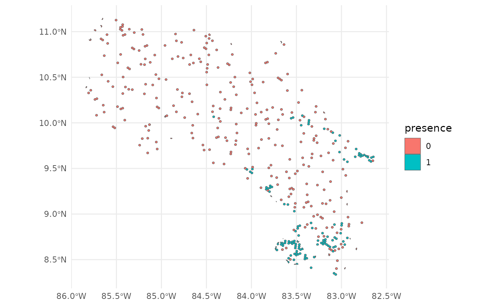
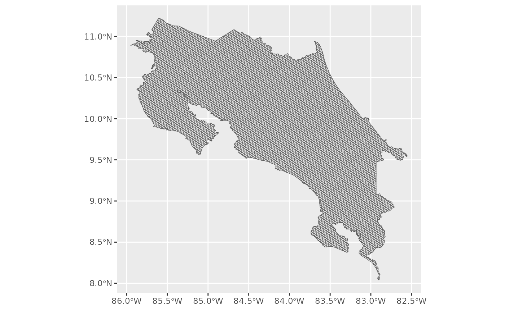
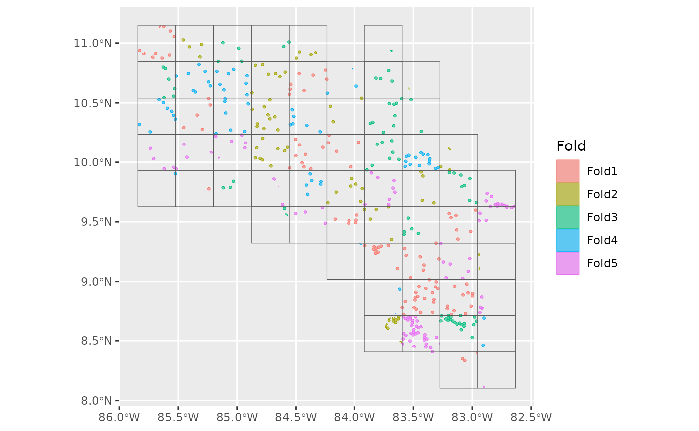
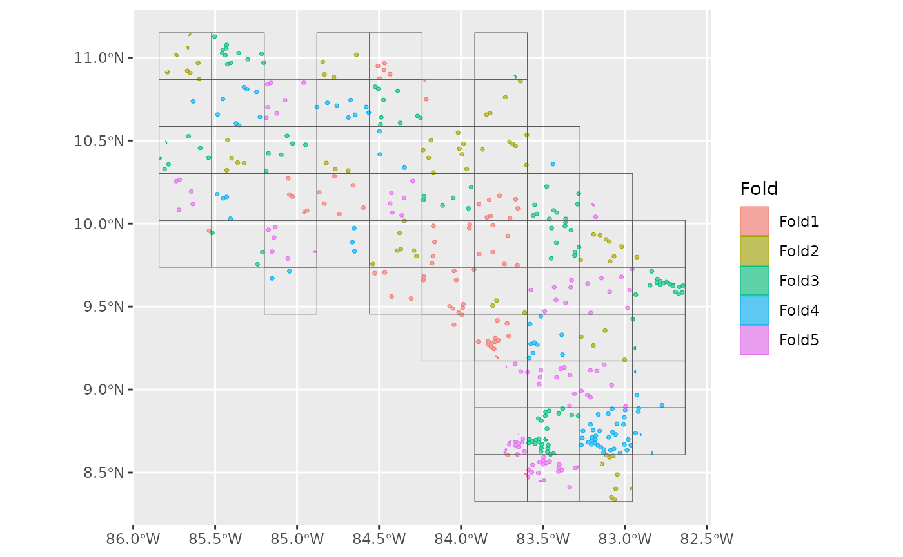
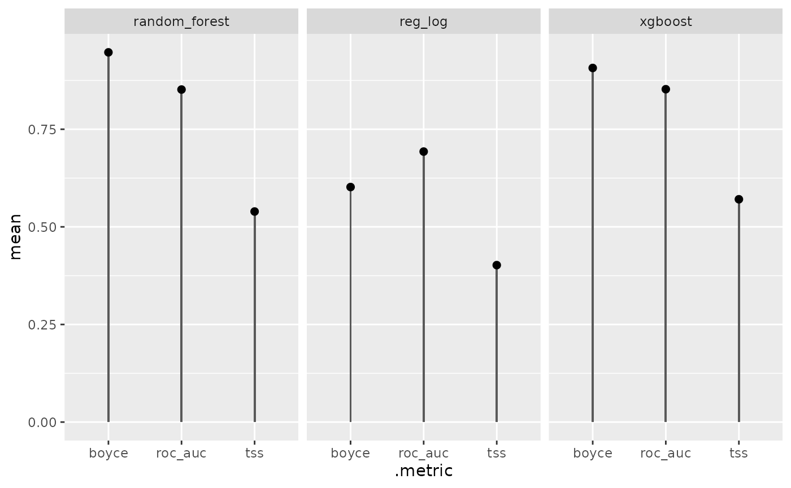
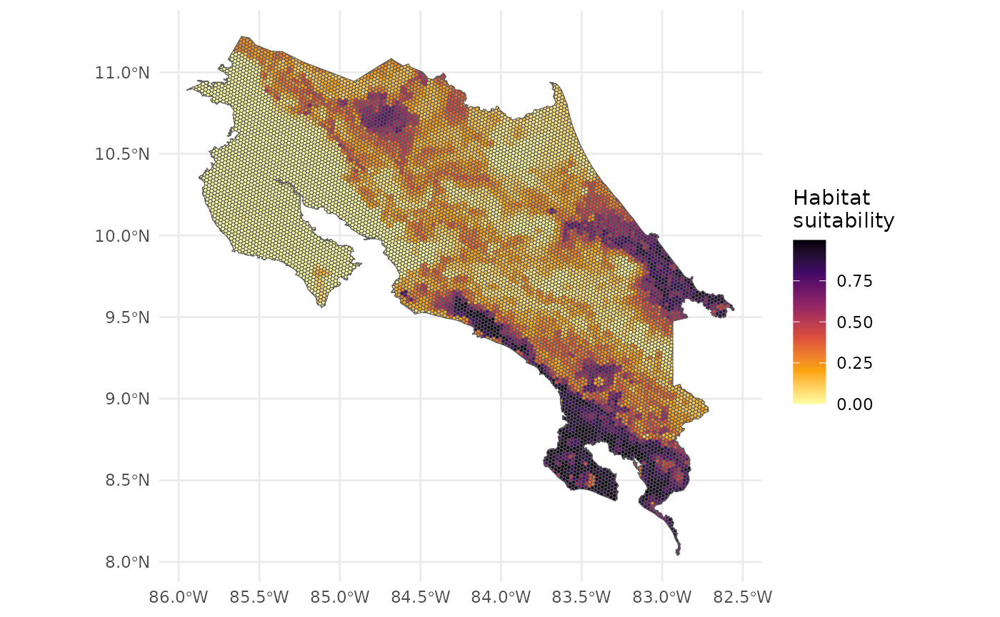
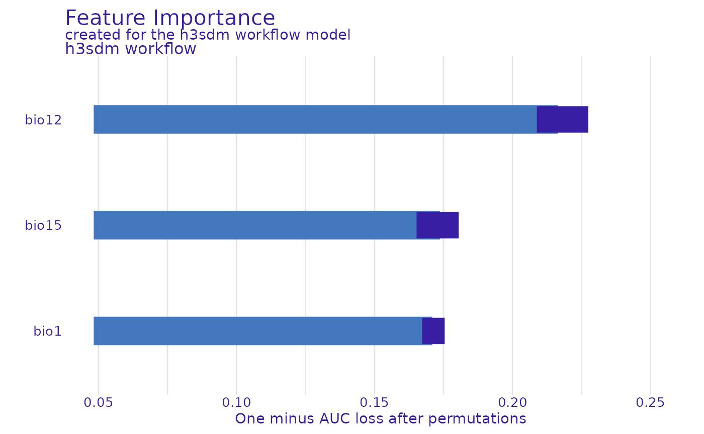
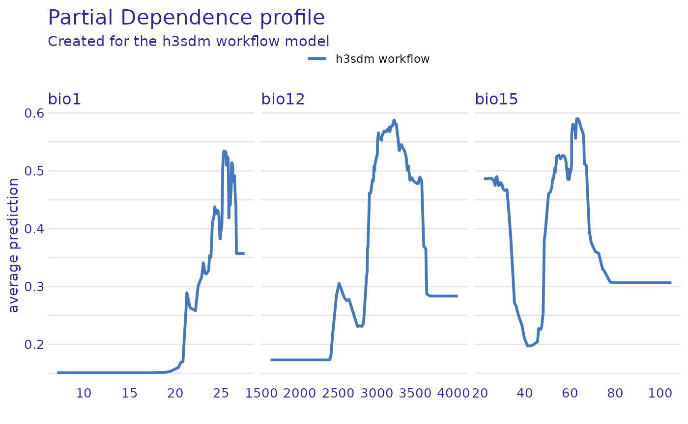

# h3sdm workflow for multiple models

``` r
# Load the required packages
library(h3sdm)
library(paisaje)
library(tidyverse)
library(here)
library(tidymodels)
library(spatialsample)
library(sf)
library(terra)
library(tidyterra)
library(DALEX)
library(DALEXtra)
library(ingredients)
library(exactextractr)
library(workflowsets)
library(themis)
library(ranger)
library(xgboost)
library(stacks)
```

## 1. Define the Area of Interest

We start by defining the geographical area for modeling. Here we use
Costa Rica as an example. The file is includesd in the ‘h3sdm’ package.

``` r
cr <- cr_outline_c
```

## 2. Load Environmental Predictors

We use WorldClim historic bioclimatic variables for Costa Rica as
environmental predictors. The data is included in the ‘h3sdm’ package.

``` r
bio <- terra::rast(system.file("extdata", "bioclim_current.tif", package = "h3sdm"))
```

``` r
names(bio) <- gsub(".*bio_", "bio", names(bio))
```

## 3. Load Species Occurrence Data

Here we obtain presence–absence data for the species of interest
(Silverstoneia flotator). We use the h3sdm_pa function to generate both
presence and pseudo-absence records. A limit of 10,000 records is set to
ensure that all presence records are retrieved, and 300 pseudo-absences
are generated.

There are different methods for generating pseudo-absences; here, we
rely on random sampling. Since there are approximately 100 positive
hexagons at resolution 7, we request three times that number (i.e., 300)
of pseudo-absences. At this resolution, H3 hexagons are about 5.16 ha in
size. These parameters can be adjusted depending on your specific needs
and the characteristics of the species being modeled.

``` r
records <- h3sdm_pa("Silverstoneia flotator", cr, res = 7, limit = 10000, n_pseudoabs = 300)
```

``` r
head(records)
#> Simple feature collection with 6 features and 2 fields
#> Geometry type: MULTIPOLYGON
#> Dimension:     XY
#> Bounding box:  xmin: -84.06344 ymin: 8.486587 xmax: -82.77295 ymax: 9.643344
#> Geodetic CRS:  WGS 84
#>          h3_address presence                       geometry
#> 43  8766b4415ffffff        1 MULTIPOLYGON (((-84.05549 9...
#> 165 87679b636ffffff        1 MULTIPOLYGON (((-82.79149 9...
#> 198 8766b54d3ffffff        1 MULTIPOLYGON (((-83.18895 8...
#> 427 87679b78effffff        1 MULTIPOLYGON (((-82.85228 9...
#> 796 8766b0135ffffff        1 MULTIPOLYGON (((-83.71366 8...
#> 893 8766b014cffffff        1 MULTIPOLYGON (((-83.53362 8...
```

``` r
table(records$presence)
#> 
#>   0   1 
#> 300 125
```

``` r
ggplot() +
  theme_minimal() +
  geom_sf(data = records, aes(fill = presence))
```



## 4. Prepare Predictors

Prepare environmental predictors by extracting values for each hexagon
in the study area. In this case prepare only de bioclimatic variables.
As we are working with a resolutio 7 we create a grid with the same
resolution.

``` r
h7 <- h3sdm_get_grid(cr, res = 7)
```

``` r
ggplot() +
  geom_sf(data = h7)
```



``` r
bio_predictors <- h3sdm_extract_num(bio, h7)
#>   |                                                                     |                                                             |   0%  |                                                                     |                                                             |   1%  |                                                                     |=                                                            |   1%  |                                                                     |=                                                            |   2%  |                                                                     |==                                                           |   2%  |                                                                     |==                                                           |   3%  |                                                                     |==                                                           |   4%  |                                                                     |===                                                          |   4%  |                                                                     |===                                                          |   5%  |                                                                     |===                                                          |   6%  |                                                                     |====                                                         |   6%  |                                                                     |====                                                         |   7%  |                                                                     |=====                                                        |   7%  |                                                                     |=====                                                        |   8%  |                                                                     |=====                                                        |   9%  |                                                                     |======                                                       |   9%  |                                                                     |======                                                       |  10%  |                                                                     |======                                                       |  11%  |                                                                     |=======                                                      |  11%  |                                                                     |=======                                                      |  12%  |                                                                     |========                                                     |  12%  |                                                                     |========                                                     |  13%  |                                                                     |========                                                     |  14%  |                                                                     |=========                                                    |  14%  |                                                                     |=========                                                    |  15%  |                                                                     |=========                                                    |  16%  |                                                                     |==========                                                   |  16%  |                                                                     |==========                                                   |  17%  |                                                                     |===========                                                  |  17%  |                                                                     |===========                                                  |  18%  |                                                                     |===========                                                  |  19%  |                                                                     |============                                                 |  19%  |                                                                     |============                                                 |  20%  |                                                                     |=============                                                |  20%  |                                                                     |=============                                                |  21%  |                                                                     |=============                                                |  22%  |                                                                     |==============                                               |  22%  |                                                                     |==============                                               |  23%  |                                                                     |==============                                               |  24%  |                                                                     |===============                                              |  24%  |                                                                     |===============                                              |  25%  |                                                                     |================                                             |  25%  |                                                                     |================                                             |  26%  |                                                                     |================                                             |  27%  |                                                                     |=================                                            |  27%  |                                                                     |=================                                            |  28%  |                                                                     |=================                                            |  29%  |                                                                     |==================                                           |  29%  |                                                                     |==================                                           |  30%  |                                                                     |===================                                          |  30%  |                                                                     |===================                                          |  31%  |                                                                     |===================                                          |  32%  |                                                                     |====================                                         |  32%  |                                                                     |====================                                         |  33%  |                                                                     |====================                                         |  34%  |                                                                     |=====================                                        |  34%  |                                                                     |=====================                                        |  35%  |                                                                     |======================                                       |  35%  |                                                                     |======================                                       |  36%  |                                                                     |======================                                       |  37%  |                                                                     |=======================                                      |  37%  |                                                                     |=======================                                      |  38%  |                                                                     |=======================                                      |  39%  |                                                                     |========================                                     |  39%  |                                                                     |========================                                     |  40%  |                                                                     |=========================                                    |  40%  |                                                                     |=========================                                    |  41%  |                                                                     |=========================                                    |  42%  |                                                                     |==========================                                   |  42%  |                                                                     |==========================                                   |  43%  |                                                                     |===========================                                  |  43%  |                                                                     |===========================                                  |  44%  |                                                                     |===========================                                  |  45%  |                                                                     |============================                                 |  45%  |                                                                     |============================                                 |  46%  |                                                                     |============================                                 |  47%  |                                                                     |=============================                                |  47%  |                                                                     |=============================                                |  48%  |                                                                     |==============================                               |  48%  |                                                                     |==============================                               |  49%  |                                                                     |==============================                               |  50%  |                                                                     |===============================                              |  50%  |                                                                     |===============================                              |  51%  |                                                                     |===============================                              |  52%  |                                                                     |================================                             |  52%  |                                                                     |================================                             |  53%  |                                                                     |=================================                            |  53%  |                                                                     |=================================                            |  54%  |                                                                     |=================================                            |  55%  |                                                                     |==================================                           |  55%  |                                                                     |==================================                           |  56%  |                                                                     |==================================                           |  57%  |                                                                     |===================================                          |  57%  |                                                                     |===================================                          |  58%  |                                                                     |====================================                         |  58%  |                                                                     |====================================                         |  59%  |                                                                     |====================================                         |  60%  |                                                                     |=====================================                        |  60%  |                                                                     |=====================================                        |  61%  |                                                                     |======================================                       |  61%  |                                                                     |======================================                       |  62%  |                                                                     |======================================                       |  63%  |                                                                     |=======================================                      |  63%  |                                                                     |=======================================                      |  64%  |                                                                     |=======================================                      |  65%  |                                                                     |========================================                     |  65%  |                                                                     |========================================                     |  66%  |                                                                     |=========================================                    |  66%  |                                                                     |=========================================                    |  67%  |                                                                     |=========================================                    |  68%  |                                                                     |==========================================                   |  68%  |                                                                     |==========================================                   |  69%  |                                                                     |==========================================                   |  70%  |                                                                     |===========================================                  |  70%  |                                                                     |===========================================                  |  71%  |                                                                     |============================================                 |  71%  |                                                                     |============================================                 |  72%  |                                                                     |============================================                 |  73%  |                                                                     |=============================================                |  73%  |                                                                     |=============================================                |  74%  |                                                                     |=============================================                |  75%  |                                                                     |==============================================               |  75%  |                                                                     |==============================================               |  76%  |                                                                     |===============================================              |  76%  |                                                                     |===============================================              |  77%  |                                                                     |===============================================              |  78%  |                                                                     |================================================             |  78%  |                                                                     |================================================             |  79%  |                                                                     |================================================             |  80%  |                                                                     |=================================================            |  80%  |                                                                     |=================================================            |  81%  |                                                                     |==================================================           |  81%  |                                                                     |==================================================           |  82%  |                                                                     |==================================================           |  83%  |                                                                     |===================================================          |  83%  |                                                                     |===================================================          |  84%  |                                                                     |====================================================         |  84%  |                                                                     |====================================================         |  85%  |                                                                     |====================================================         |  86%  |                                                                     |=====================================================        |  86%  |                                                                     |=====================================================        |  87%  |                                                                     |=====================================================        |  88%  |                                                                     |======================================================       |  88%  |                                                                     |======================================================       |  89%  |                                                                     |=======================================================      |  89%  |                                                                     |=======================================================      |  90%  |                                                                     |=======================================================      |  91%  |                                                                     |========================================================     |  91%  |                                                                     |========================================================     |  92%  |                                                                     |========================================================     |  93%  |                                                                     |=========================================================    |  93%  |                                                                     |=========================================================    |  94%  |                                                                     |==========================================================   |  94%  |                                                                     |==========================================================   |  95%  |                                                                     |==========================================================   |  96%  |                                                                     |===========================================================  |  96%  |                                                                     |===========================================================  |  97%  |                                                                     |===========================================================  |  98%  |                                                                     |============================================================ |  98%  |                                                                     |============================================================ |  99%  |                                                                     |=============================================================|  99%  |                                                                     |=============================================================| 100%
```

``` r
predictors <- h3sdm_predictors(bio_predictors)
```

In this case we select Bio1 (Annual Mean Temperature), Bio12 (Annual
Precipitation), and Bio15 (Precipitation Seasonality).

``` r
predictors <- predictors |>
  dplyr::select(h3_address, bio1, bio12, bio15, geometry)
```

We can visualize one of the predictors, for example Bio1.

``` r
ggplot() +
  theme_minimal() +
  geom_sf(data = predictors, aes(fill = bio1)) +
  scale_fill_viridis_c(option = "B")
```



## 5. Combine Records and Predictors

Merge species occurrence records with environmental predictors.

``` r
dat <- h3sdm_data(records, predictors)
```

## 6. Spatial Cross-Validation

Define spatial blocks for cross-validation to account for spatial
autocorrelation.

``` r
scv <- h3sdm_spatial_cv(dat, v = 5, repeats = 1)
```

Plot the spatial blocks.

``` r
autoplot(scv)
```



## 7. Define Recipe and Models (multiple models)

Create a modeling recipe and specify the classification model. We start
with presence–absence data aggregated in hexagonal cells. From the
initial data, we obtained roughly 100 hexagons with presence (presence =
1). For pseudo-absences, we sampled about three times more absence
hexagons (presence = 0) to ensure sufficient coverage.

This results in an imbalanced dataset, which can bias the model toward
predicting absences. To correct for this, we use
step_downsample(presence) from the themis package.

``` r
receta <- h3sdm_recipe(dat) |>
  themis::step_downsample(presence) |>
  step_dummy(all_nominal_predictors())
```

Key points:

- Only the majority class (pseudo-absence hexagons) is reduced.

- The minority class (presence hexagons) remains unchanged.

- After down-sampling, the dataset is balanced, improving model training
  and evaluation.

In our case, down-sampling ensures that the 100 presence hexagons and a
comparable number of pseudo-absence hexagons are used for modeling,
preventing bias toward absences while retaining the full presence
information.

Now we define more than one model using the `parsnip` package, from the
tidymodels framework.

``` r
# Define your models using parsnip
# Modelos con defaults
mod_log <- logistic_reg() %>%
  set_engine("glm") %>%
  set_mode("classification")

mod_rf <- rand_forest() %>%
  set_engine("ranger") %>%
  set_mode("classification")

mod_xgb <- boost_tree() %>%        # usa defaults
  set_engine("xgboost") %>%
  set_mode("classification")

# Create a named list of the models
my_models <- list(
  reg_log = mod_log,
  random_forest = mod_rf,
  xgboost = mod_xgb
)
```

## 8. Create Workflows

``` r
wfs <- h3sdm_workflows(my_models, receta)
```

``` r
wfs
#> $reg_log
#> ══ Workflow ═══════════════════════════════════════════════════════════
#> Preprocessor: Recipe
#> Model: logistic_reg()
#> 
#> ── Preprocessor ───────────────────────────────────────────────────────
#> 2 Recipe Steps
#> 
#> • step_downsample()
#> • step_dummy()
#> 
#> ── Model ──────────────────────────────────────────────────────────────
#> Logistic Regression Model Specification (classification)
#> 
#> Computational engine: glm 
#> 
#> 
#> $random_forest
#> ══ Workflow ═══════════════════════════════════════════════════════════
#> Preprocessor: Recipe
#> Model: rand_forest()
#> 
#> ── Preprocessor ───────────────────────────────────────────────────────
#> 2 Recipe Steps
#> 
#> • step_downsample()
#> • step_dummy()
#> 
#> ── Model ──────────────────────────────────────────────────────────────
#> Random Forest Model Specification (classification)
#> 
#> Computational engine: ranger 
#> 
#> 
#> $xgboost
#> ══ Workflow ═══════════════════════════════════════════════════════════
#> Preprocessor: Recipe
#> Model: boost_tree()
#> 
#> ── Preprocessor ───────────────────────────────────────────────────────
#> 2 Recipe Steps
#> 
#> • step_downsample()
#> • step_dummy()
#> 
#> ── Model ──────────────────────────────────────────────────────────────
#> Boosted Tree Model Specification (classification)
#> 
#> Computational engine: xgboost
```

## 9. Fit the Models

Before fitting the model, we need to extract the presence data from the
dataset. This ensures that metrics, cross-validation, and evaluation
focus correctly on the locations where the species is actually present.

``` r
presence_data <- dat %>%
  dplyr::filter(presence == 1)
```

Next, we fit the models using the spatial cross-validation scheme.
Spatial CV accounts for spatial autocorrelation by partitioning the data
into spatially distinct folds, providing a more realistic assessment of
model performance compared to random CV.

``` r
several <- h3sdm_fit_models(wfs, scv, presence_data)
```

## 10. Evaluate and Compare Models

``` r
compare <- h3sdm_compare_models(several)
compare
#> # A tibble: 9 × 7
#>   model         .metric .estimator  mean std_err conf_low conf_high
#>   <chr>         <chr>   <chr>      <dbl>   <dbl>    <dbl>     <dbl>
#> 1 random_forest boyce   binary     0.947 NA        NA        NA    
#> 2 xgboost       boyce   binary     0.907 NA        NA        NA    
#> 3 xgboost       roc_auc binary     0.853  0.0248    0.804     0.901
#> 4 random_forest roc_auc binary     0.852  0.0286    0.796     0.908
#> 5 reg_log       roc_auc binary     0.693  0.0340    0.626     0.759
#> 6 reg_log       boyce   binary     0.602 NA        NA        NA    
#> 7 xgboost       tss     binary     0.571 NA        NA        NA    
#> 8 random_forest tss     binary     0.539 NA        NA        NA    
#> 9 reg_log       tss     binary     0.402 NA        NA        NA
```

1.  ROC AUC (roc_auc) → evaluates the model’s ability to discriminate
    between presence and absence/pseudo-absence, regardless of the
    threshold. It is the standard metric for probabilistic
    classification.

2.  Maximum TSS (tss_max) → combines sensitivity and specificity into a
    single threshold-dependent value, showing how well the model
    predicts presences and absences simultaneously.

3.  Boyce index (boyce) → measures the model’s ability to predict
    species distribution continuously and assesses whether areas with
    higher predicted values coincide with observed presences.

``` r
ggplot(compare, aes(.metric, mean)) +
  geom_col(width = 0.03) +
  geom_point(size = 2) +
  facet_wrap(~model)
```



## 11. Select the Best Model and make Predictions

``` r
p_rf <- h3sdm_predict(several$models$random_forest, predictors)
```

``` r
p_rf
#> Simple feature collection with 10417 features and 7 fields
#> Geometry type: MULTIPOLYGON
#> Dimension:     XY
#> Bounding box:  xmin: -85.95025 ymin: 8.039627 xmax: -82.55232 ymax: 11.21976
#> Geodetic CRS:  WGS 84
#> First 10 features:
#>         h3_address     bio1    bio12    bio15
#> 1  876d6854dffffff 26.61501 1632.814 94.14928
#> 2  876d6bb8effffff 26.62722 2215.888 92.49077
#> 3  87679b4f5ffffff 25.08632 3023.892 26.03154
#> 4  8766b5d82ffffff 13.71321 3982.812 37.47940
#> 5  8766b4528ffffff 15.85883 2214.000 75.75454
#> 6  876d68adaffffff 23.29059 2412.908 69.25448
#> 7  876d6d625ffffff 26.03058 3024.874 47.24875
#> 8  876d6878affffff 26.30600 1746.000 91.93986
#> 9  8766b4ab5ffffff 20.26178 2883.596 41.66865
#> 10 876d69c94ffffff 22.67291 2361.003 70.83282
#>                          geometry         x         y   prediction
#> 1  MULTIPOLYGON (((-85.61874 1... -85.61355 10.744993 0.0006666667
#> 2  MULTIPOLYGON (((-85.2204 9.... -85.21517  9.805806 0.0000000000
#> 3  MULTIPOLYGON (((-83.01133 9... -83.00602  9.806921 0.6434214286
#> 4  MULTIPOLYGON (((-83.07362 9... -83.06830  9.295924 0.0160039683
#> 5  MULTIPOLYGON (((-83.93635 9... -83.93107  9.638151 0.0616571429
#> 6  MULTIPOLYGON (((-85.04019 1... -85.03497 10.579597 0.1220730159
#> 7  MULTIPOLYGON (((-84.50184 1... -84.49660 10.874768 0.2364650794
#> 8  MULTIPOLYGON (((-85.69967 1... -85.69448 10.433590 0.0033833333
#> 9  MULTIPOLYGON (((-83.32541 9... -83.32010  9.539664 0.0429460317
#> 10 MULTIPOLYGON (((-84.94068 1... -84.93545 10.420003 0.1178111111
```

## 12. Map

Now we can visualize the predictions in a map.

``` r
ggplot() +
  theme_minimal() +
  geom_sf(data = p_rf, aes(fill = prediction)) +
  scale_fill_viridis_c(name = "Habitat \nsuitability",option = "B", direction = -1)
```



The map represents habitat suitability for the species across the
hexagons. The values (usually between 0 and 1 for a logistic model)
indicate the habitat suitability of each hexagon for the species.

Interpretation of the prediction values:

- Higher values → more suitable habitat
- Lower values → less suitable habitat

## 13. Model Interpretation: Feature Importance & Partial Dependence

Finallly, we interpret the model to understand which predictors are most
influential and how they affect predictions.

First, we extract the fitted random forest model from the list of
models.

``` r
rf_fitted <- several$models$random_forest$final_model
```

Then we create an explainer object using the DALEX package.

``` r
e <- h3sdm_explain(rf_fitted, data = dat)
#> Preparation of a new explainer is initiated
#>   -> model label       :  h3sdm workflow 
#>   -> data              :  425  rows  6  cols 
#>   -> target variable   :  425  values 
#>   -> predict function  :  custom_predict 
#>   -> predicted values  :  No value for predict function target column. (  default  )
#>   -> model_info        :  package tidymodels , ver. 1.4.1 , task classification (  default  ) 
#>   -> predicted values  :  numerical, min =  0 , mean =  0.410587 , max =  0.9972198  
#>   -> residual function :  difference between y and yhat (  default  )
#>   -> residuals         :  numerical, min =  -0.9884127 , mean =  -0.1164693 , max =  0.740946  
#>   A new explainer has been created!
```

### Feature Importance

We evaluate the importance of each predictor variable using permutation
importance. This method assesses how much the model’s performance
decreases when the values of a predictor are randomly shuffled,
indicating its contribution to the model.

We need to specify the predictor variables to evaluate, excluding
non-predictor columns.

``` r
predictors_to_evaluate <- setdiff(names(e$data), c("h3_address", "x", "y", "presence"))
```

Now we compute variable importance.

``` r
var_imp <- model_parts(
  explainer = e,
  variables = predictors_to_evaluate
)
```

We can visualize the variable importance.

``` r
plot(var_imp)
```



### Partial Dependence Plots

We create partial dependence plots (PDPs) to visualize the relationship
between key predictors and the predicted habitat suitability. PDPs show
how the predicted outcome changes as a single predictor varies, while
averaging out the effects of other predictors.

``` r
pdp_glm <- partial_dependence(e, variables = c("bio12", "bio1", "bio15"))
```

Now we can plot the PDPs.

``` r
plot(pdp_glm)
```



All predictors show a positive relationship with habitat suitability,
but Bio12 (annual precipitation) and Bio1 (mean annual temperature)
stand out with higher importance and stronger positive effects. In
contrast, Bio15 (precipitation seasonality) has a weaker positive
effect, suggesting that while areas with variable rainfall are somewhat
suitable, they are less influential than Bio12 or Bio1.

## 14. Conclusions

This tutorial demonstrated a complete SDM workflow for multiple models
using the `h3sdm` package. The key steps included:

- Defining the study area

- Loading and preparing environmental predictors

- Fetching species occurrence data

- Building several predictive models with spatial cross-validation

- Evaluating performance and makingpredictions

- Assessing variable importance

This workflow demonstrates modeling for a single species using more than
one model.
