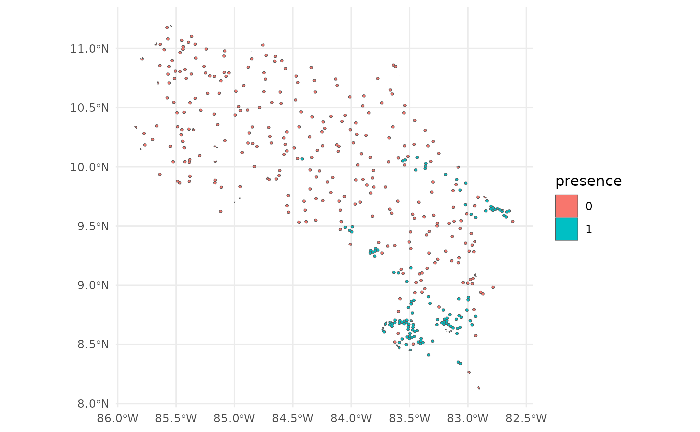
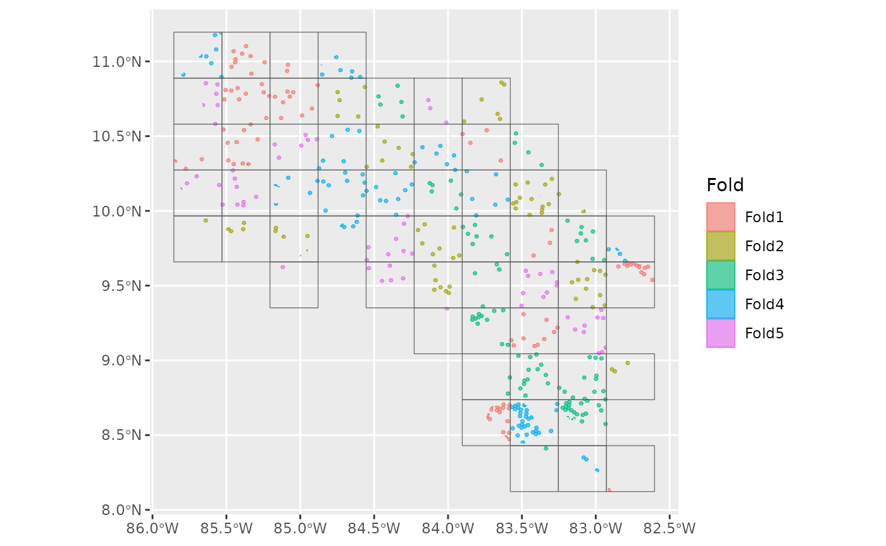
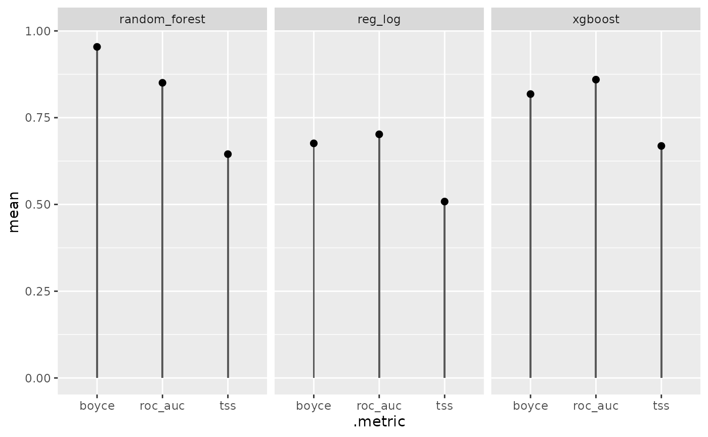
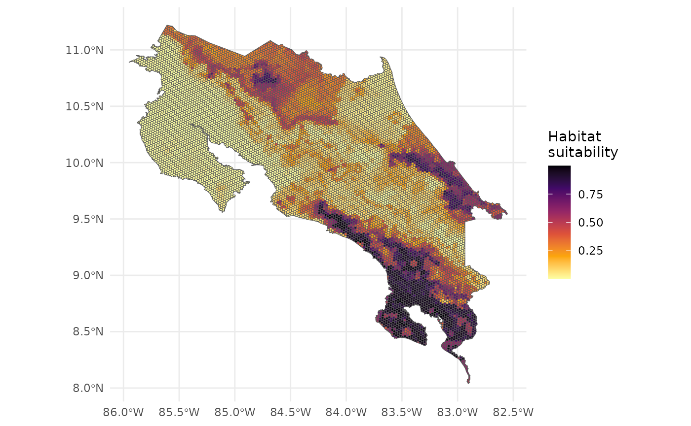
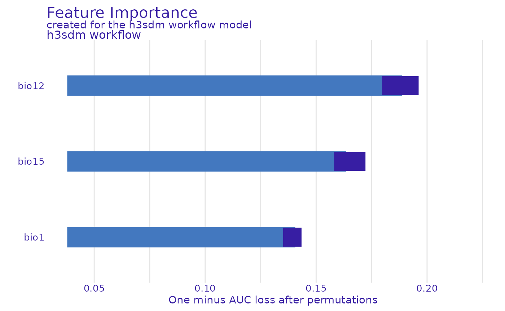
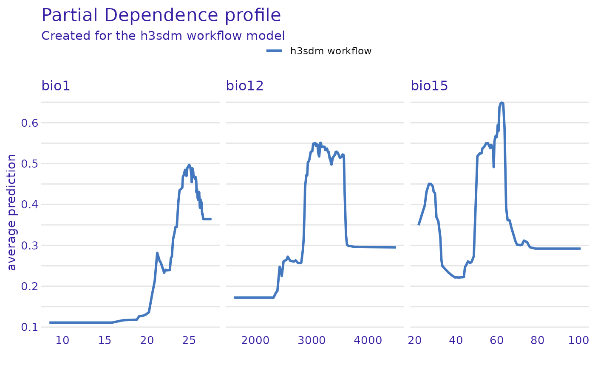

# h3sdm workflow for multiple models

## Introduction

This vignette demonstrates a complete SDM workflow for a single species
using multiple model types with `h3sdm`. We cover data preparation with
a hexagonal grid, environmentally stratified pseudo-absence generation,
model fitting with spatial cross-validation, performance comparison,
predictions, and variable importance analysis.

## Load packages

``` r

library(h3sdm)
library(tidyverse)
library(tidymodels)
library(spatialsample)
library(sf)
library(terra)
library(DALEX)
library(DALEXtra)
library(ingredients)
library(workflowsets)
library(themis)
library(ranger)
library(xgboost)
library(stacks)
```

## 1. Define the Area of Interest

We start by defining the geographical area for modeling. Here we use
Costa Rica as an example. The file is included in the `h3sdm` package.

``` r

cr <- cr_outline_c
```

## 2. Load Environmental Predictors

We use WorldClim historic bioclimatic variables for Costa Rica as
environmental predictors. The data is included in the `h3sdm` package.

``` r

bio <- terra::rast(system.file("extdata", "bioclim_current.tif", package = "h3sdm"))
names(bio) <- gsub(".*bio_", "bio", names(bio))
```

## 3. Create the Hexagonal Grid

The hexagonal grid is the backbone of the `h3sdm` workflow. All
subsequent steps — predictor extraction, presence assignment, and
pseudo-absence generation — are built on top of it. At resolution 7,
each hexagon covers approximately 514 ha, which is appropriate for many
vertebrate species.

``` r

h7 <- h3sdm_get_grid(cr, res = 7)
```

``` r

ggplot() +
  geom_sf(data = h7)
```


## 4. Prepare Predictors

Environmental variables are extracted for every hexagon in the grid.
Here we use three WorldClim bioclimatic variables: Bio1 (Annual Mean
Temperature), Bio12 (Annual Precipitation), and Bio15 (Precipitation
Seasonality).

``` r

bio_predictors <- h3sdm_extract_num(bio, h7)
#>   |                                                                     |                                                             |   0%  |                                                                     |                                                             |   1%  |                                                                     |=                                                            |   1%  |                                                                     |=                                                            |   2%  |                                                                     |==                                                           |   2%  |                                                                     |==                                                           |   3%  |                                                                     |==                                                           |   4%  |                                                                     |===                                                          |   4%  |                                                                     |===                                                          |   5%  |                                                                     |===                                                          |   6%  |                                                                     |====                                                         |   6%  |                                                                     |====                                                         |   7%  |                                                                     |=====                                                        |   7%  |                                                                     |=====                                                        |   8%  |                                                                     |=====                                                        |   9%  |                                                                     |======                                                       |   9%  |                                                                     |======                                                       |  10%  |                                                                     |======                                                       |  11%  |                                                                     |=======                                                      |  11%  |                                                                     |=======                                                      |  12%  |                                                                     |========                                                     |  12%  |                                                                     |========                                                     |  13%  |                                                                     |========                                                     |  14%  |                                                                     |=========                                                    |  14%  |                                                                     |=========                                                    |  15%  |                                                                     |=========                                                    |  16%  |                                                                     |==========                                                   |  16%  |                                                                     |==========                                                   |  17%  |                                                                     |===========                                                  |  17%  |                                                                     |===========                                                  |  18%  |                                                                     |===========                                                  |  19%  |                                                                     |============                                                 |  19%  |                                                                     |============                                                 |  20%  |                                                                     |=============                                                |  20%  |                                                                     |=============                                                |  21%  |                                                                     |=============                                                |  22%  |                                                                     |==============                                               |  22%  |                                                                     |==============                                               |  23%  |                                                                     |==============                                               |  24%  |                                                                     |===============                                              |  24%  |                                                                     |===============                                              |  25%  |                                                                     |================                                             |  25%  |                                                                     |================                                             |  26%  |                                                                     |================                                             |  27%  |                                                                     |=================                                            |  27%  |                                                                     |=================                                            |  28%  |                                                                     |=================                                            |  29%  |                                                                     |==================                                           |  29%  |                                                                     |==================                                           |  30%  |                                                                     |===================                                          |  30%  |                                                                     |===================                                          |  31%  |                                                                     |===================                                          |  32%  |                                                                     |====================                                         |  32%  |                                                                     |====================                                         |  33%  |                                                                     |====================                                         |  34%  |                                                                     |=====================                                        |  34%  |                                                                     |=====================                                        |  35%  |                                                                     |======================                                       |  35%  |                                                                     |======================                                       |  36%  |                                                                     |======================                                       |  37%  |                                                                     |=======================                                      |  37%  |                                                                     |=======================                                      |  38%  |                                                                     |=======================                                      |  39%  |                                                                     |========================                                     |  39%  |                                                                     |========================                                     |  40%  |                                                                     |=========================                                    |  40%  |                                                                     |=========================                                    |  41%  |                                                                     |=========================                                    |  42%  |                                                                     |==========================                                   |  42%  |                                                                     |==========================                                   |  43%  |                                                                     |===========================                                  |  43%  |                                                                     |===========================                                  |  44%  |                                                                     |===========================                                  |  45%  |                                                                     |============================                                 |  45%  |                                                                     |============================                                 |  46%  |                                                                     |============================                                 |  47%  |                                                                     |=============================                                |  47%  |                                                                     |=============================                                |  48%  |                                                                     |==============================                               |  48%  |                                                                     |==============================                               |  49%  |                                                                     |==============================                               |  50%  |                                                                     |===============================                              |  50%  |                                                                     |===============================                              |  51%  |                                                                     |===============================                              |  52%  |                                                                     |================================                             |  52%  |                                                                     |================================                             |  53%  |                                                                     |=================================                            |  53%  |                                                                     |=================================                            |  54%  |                                                                     |=================================                            |  55%  |                                                                     |==================================                           |  55%  |                                                                     |==================================                           |  56%  |                                                                     |==================================                           |  57%  |                                                                     |===================================                          |  57%  |                                                                     |===================================                          |  58%  |                                                                     |====================================                         |  58%  |                                                                     |====================================                         |  59%  |                                                                     |====================================                         |  60%  |                                                                     |=====================================                        |  60%  |                                                                     |=====================================                        |  61%  |                                                                     |======================================                       |  61%  |                                                                     |======================================                       |  62%  |                                                                     |======================================                       |  63%  |                                                                     |=======================================                      |  63%  |                                                                     |=======================================                      |  64%  |                                                                     |=======================================                      |  65%  |                                                                     |========================================                     |  65%  |                                                                     |========================================                     |  66%  |                                                                     |=========================================                    |  66%  |                                                                     |=========================================                    |  67%  |                                                                     |=========================================                    |  68%  |                                                                     |==========================================                   |  68%  |                                                                     |==========================================                   |  69%  |                                                                     |==========================================                   |  70%  |                                                                     |===========================================                  |  70%  |                                                                     |===========================================                  |  71%  |                                                                     |============================================                 |  71%  |                                                                     |============================================                 |  72%  |                                                                     |============================================                 |  73%  |                                                                     |=============================================                |  73%  |                                                                     |=============================================                |  74%  |                                                                     |=============================================                |  75%  |                                                                     |==============================================               |  75%  |                                                                     |==============================================               |  76%  |                                                                     |===============================================              |  76%  |                                                                     |===============================================              |  77%  |                                                                     |===============================================              |  78%  |                                                                     |================================================             |  78%  |                                                                     |================================================             |  79%  |                                                                     |================================================             |  80%  |                                                                     |=================================================            |  80%  |                                                                     |=================================================            |  81%  |                                                                     |==================================================           |  81%  |                                                                     |==================================================           |  82%  |                                                                     |==================================================           |  83%  |                                                                     |===================================================          |  83%  |                                                                     |===================================================          |  84%  |                                                                     |====================================================         |  84%  |                                                                     |====================================================         |  85%  |                                                                     |====================================================         |  86%  |                                                                     |=====================================================        |  86%  |                                                                     |=====================================================        |  87%  |                                                                     |=====================================================        |  88%  |                                                                     |======================================================       |  88%  |                                                                     |======================================================       |  89%  |                                                                     |=======================================================      |  89%  |                                                                     |=======================================================      |  90%  |                                                                     |=======================================================      |  91%  |                                                                     |========================================================     |  91%  |                                                                     |========================================================     |  92%  |                                                                     |========================================================     |  93%  |                                                                     |=========================================================    |  93%  |                                                                     |=========================================================    |  94%  |                                                                     |==========================================================   |  94%  |                                                                     |==========================================================   |  95%  |                                                                     |==========================================================   |  96%  |                                                                     |===========================================================  |  96%  |                                                                     |===========================================================  |  97%  |                                                                     |===========================================================  |  98%  |                                                                     |============================================================ |  98%  |                                                                     |============================================================ |  99%  |                                                                     |=============================================================|  99%  |                                                                     |=============================================================| 100%
```

``` r

predictors <- h3sdm_predictors(bio_predictors) |>
  dplyr::select(h3_address, bio1, bio12, bio15, geometry)
```

We can visualize one of the predictors, for example Bio1.

``` r

ggplot() +
  theme_minimal() +
  geom_sf(data = predictors, aes(fill = bio1)) +
  scale_fill_viridis_c(option = "B")
```


## 5. Species Occurrence Data

Presence hexagons are generated using
[`h3sdm_pres()`](https://manuelspinola.github.io/h3sdm/reference/h3sdm_pres.md),
which downloads occurrence records and assigns them to hexagons.
Multiple records within the same hexagon are consolidated into a single
presence, reducing spatial sampling bias. Since each hexagon represents
an area (~514 ha at resolution 7), this better reflects how organisms
actually occupy space.

Pseudo-absences are then generated with
[`h3sdm_pa()`](https://manuelspinola.github.io/h3sdm/reference/h3sdm_pa.md).
They are placed outside the known distribution — excluding hexagons with
presences and their immediate neighbors (`buffer_k = 1`) — and selected
using k-means clustering in environmental space. This ensures
pseudo-absences represent the full range of environmental conditions
available in the study area. Since there are approximately 100 presence
hexagons at resolution 7, we request 300 pseudo-absences (3×).

``` r

pres <- h3sdm_pres("Silverstoneia flotator", cr, res = 7, limit = 10000)
```

``` r

records <- h3sdm_pa(pres, predictors, n_pseudoabs = 300)
```

``` r

head(records)
#> Simple feature collection with 6 features and 2 fields
#> Geometry type: MULTIPOLYGON
#> Dimension:     XY
#> Bounding box:  xmin: -84.06344 ymin: 8.486587 xmax: -82.77295 ymax: 9.643344
#> Geodetic CRS:  WGS 84
#>          h3_address presence                       geometry
#> 43  8766b4415ffffff        1 MULTIPOLYGON (((-84.05549 9...
#> 165 87679b636ffffff        1 MULTIPOLYGON (((-82.79149 9...
#> 198 8766b54d3ffffff        1 MULTIPOLYGON (((-83.18895 8...
#> 427 87679b78effffff        1 MULTIPOLYGON (((-82.85228 9...
#> 796 8766b0135ffffff        1 MULTIPOLYGON (((-83.71366 8...
#> 893 8766b014cffffff        1 MULTIPOLYGON (((-83.53362 8...
```

``` r

table(records$presence)
#> 
#>   0   1 
#> 300 127
```

``` r

ggplot() +
  theme_minimal() +
  geom_sf(data = records, aes(fill = presence))
```



## 6. Combine Records and Predictors

Merge species occurrence records with environmental predictors.

``` r

dat <- h3sdm_data(records, predictors)
```

## 7. Spatial Cross-Validation

Define spatial blocks for cross-validation to account for spatial
autocorrelation.

``` r

scv <- h3sdm_spatial_cv(dat, v = 5, repeats = 1)
```

``` r

autoplot(scv)
```



## 8. Define Recipe and Models

Create a modeling recipe and specify multiple classification models. We
start with presence–absence data aggregated in hexagonal cells. The
dataset is imbalanced — approximately 100 presence hexagons and 300
pseudo-absence hexagons — which can bias models toward predicting
absences. We use `step_downsample(presence)` from the `themis` package
to correct for this. After down-sampling, the dataset is balanced,
improving model training and evaluation while retaining all presence
information.

``` r

receta <- h3sdm_recipe(dat) |>
  themis::step_downsample(presence) |>
  step_dummy(all_nominal_predictors())
```

Now we define multiple models using the `parsnip` package from the
tidymodels framework.

``` r

mod_log <- logistic_reg() %>%
  set_engine("glm") %>%
  set_mode("classification")

mod_rf <- rand_forest() %>%
  set_engine("ranger") %>%
  set_mode("classification")

mod_xgb <- boost_tree() %>%
  set_engine("xgboost") %>%
  set_mode("classification")

my_models <- list(
  reg_log       = mod_log,
  random_forest = mod_rf,
  xgboost       = mod_xgb
)
```

## 9. Create Workflows

``` r

wfs <- h3sdm_workflows(my_models, receta)
```

``` r

wfs
#> $reg_log
#> ══ Workflow ═══════════════════════════════════════════════════════════
#> Preprocessor: Recipe
#> Model: logistic_reg()
#> 
#> ── Preprocessor ───────────────────────────────────────────────────────
#> 2 Recipe Steps
#> 
#> • step_downsample()
#> • step_dummy()
#> 
#> ── Model ──────────────────────────────────────────────────────────────
#> Logistic Regression Model Specification (classification)
#> 
#> Computational engine: glm 
#> 
#> 
#> $random_forest
#> ══ Workflow ═══════════════════════════════════════════════════════════
#> Preprocessor: Recipe
#> Model: rand_forest()
#> 
#> ── Preprocessor ───────────────────────────────────────────────────────
#> 2 Recipe Steps
#> 
#> • step_downsample()
#> • step_dummy()
#> 
#> ── Model ──────────────────────────────────────────────────────────────
#> Random Forest Model Specification (classification)
#> 
#> Computational engine: ranger 
#> 
#> 
#> $xgboost
#> ══ Workflow ═══════════════════════════════════════════════════════════
#> Preprocessor: Recipe
#> Model: boost_tree()
#> 
#> ── Preprocessor ───────────────────────────────────────────────────────
#> 2 Recipe Steps
#> 
#> • step_downsample()
#> • step_dummy()
#> 
#> ── Model ──────────────────────────────────────────────────────────────
#> Boosted Tree Model Specification (classification)
#> 
#> Computational engine: xgboost
```

## 10. Fit the Models

Before fitting, we extract the presence data from the dataset. This
ensures that metrics, cross-validation, and evaluation focus correctly
on the locations where the species is actually present.

``` r

presence_data <- dat %>%
  dplyr::filter(presence == 1)
```

We fit the models using the spatial cross-validation scheme. Spatial CV
accounts for spatial autocorrelation by partitioning the data into
spatially distinct folds, providing a more realistic assessment of model
performance compared to random CV.

``` r

several <- h3sdm_fit_models(wfs, scv, presence_data)
```

## 11. Evaluate and Compare Models

``` r

compare <- h3sdm_compare_models(several)
compare
#> # A tibble: 9 × 7
#>   model         .metric .estimator  mean std_err conf_low conf_high
#>   <chr>         <chr>   <chr>      <dbl>   <dbl>    <dbl>     <dbl>
#> 1 random_forest boyce   binary     0.954 NA        NA        NA    
#> 2 xgboost       roc_auc binary     0.860  0.0234    0.814     0.905
#> 3 random_forest roc_auc binary     0.850  0.0324    0.787     0.914
#> 4 xgboost       boyce   binary     0.818 NA        NA        NA    
#> 5 reg_log       roc_auc binary     0.702  0.0454    0.613     0.791
#> 6 reg_log       boyce   binary     0.676 NA        NA        NA    
#> 7 xgboost       tss     binary     0.669 NA        NA        NA    
#> 8 random_forest tss     binary     0.645 NA        NA        NA    
#> 9 reg_log       tss     binary     0.508 NA        NA        NA
```

Three metrics are reported:

- **ROC AUC** (`roc_auc`) — evaluates the model’s ability to
  discriminate between presence and pseudo-absence regardless of
  threshold. It is the standard metric for probabilistic classification.
- **Maximum TSS** (`tss_max`) — combines sensitivity and specificity
  into a single threshold-dependent value, showing how well the model
  predicts presences and absences simultaneously.
- **Boyce index** (`boyce`) — measures the model’s ability to predict
  species distribution continuously and assesses whether areas with
  higher predicted values coincide with observed presences.

``` r

ggplot(compare, aes(.metric, mean)) +
  geom_col(width = 0.03) +
  geom_point(size = 2) +
  facet_wrap(~model)
```



## 12. Select the Best Model and Make Predictions

``` r

p_rf <- h3sdm_predict(several$models$random_forest, predictors)
```

``` r

p_rf
#> Simple feature collection with 10417 features and 7 fields
#> Geometry type: MULTIPOLYGON
#> Dimension:     XY
#> Bounding box:  xmin: -85.95025 ymin: 8.039627 xmax: -82.55232 ymax: 11.21976
#> Geodetic CRS:  WGS 84
#> First 10 features:
#>         h3_address     bio1    bio12    bio15
#> 1  876d6854dffffff 26.61501 1632.814 94.14928
#> 2  876d6bb8effffff 26.62722 2215.888 92.49077
#> 3  87679b4f5ffffff 25.08632 3023.892 26.03154
#> 4  8766b5d82ffffff 13.71321 3982.812 37.47940
#> 5  8766b4528ffffff 15.85883 2214.000 75.75454
#> 6  876d68adaffffff 23.29059 2412.908 69.25448
#> 7  876d6d625ffffff 26.03058 3024.874 47.24875
#> 8  876d6878affffff 26.30600 1746.000 91.93986
#> 9  8766b4ab5ffffff 20.26178 2883.596 41.66865
#> 10 876d69c94ffffff 22.67291 2361.003 70.83282
#>                          geometry         x         y   prediction
#> 1  MULTIPOLYGON (((-85.61874 1... -85.61355 10.744993 0.0070666667
#> 2  MULTIPOLYGON (((-85.2204 9.... -85.21517  9.805806 0.0070666667
#> 3  MULTIPOLYGON (((-83.01133 9... -83.00602  9.806921 0.7782507937
#> 4  MULTIPOLYGON (((-83.07362 9... -83.06830  9.295924 0.0009722222
#> 5  MULTIPOLYGON (((-83.93635 9... -83.93107  9.638151 0.0520690476
#> 6  MULTIPOLYGON (((-85.04019 1... -85.03497 10.579597 0.0875388889
#> 7  MULTIPOLYGON (((-84.50184 1... -84.49660 10.874768 0.3333682540
#> 8  MULTIPOLYGON (((-85.69967 1... -85.69448 10.433590 0.0038190476
#> 9  MULTIPOLYGON (((-83.32541 9... -83.32010  9.539664 0.0877293651
#> 10 MULTIPOLYGON (((-84.94068 1... -84.93545 10.420003 0.0645873016
```

## 13. Map

``` r

ggplot() +
  theme_minimal() +
  geom_sf(data = p_rf, aes(fill = prediction)) +
  scale_fill_viridis_c(name = "Habitat \nsuitability", option = "B", direction = -1)
```



The map represents habitat suitability across hexagons. Values between 0
and 1 indicate the probability of the species being present in each
hexagon. Higher values indicate more suitable habitat; lower values
indicate less suitable habitat.

## 14. Model Interpretation: Feature Importance and Partial Dependence

We interpret the model to understand which predictors are most
influential and how they affect predictions. First, we extract the
fitted random forest model.

``` r

rf_fitted <- several$models$random_forest$final_model
```

Then we create an explainer object using the DALEX package.

``` r

e <- h3sdm_explain(rf_fitted, data = dat)
#> Preparation of a new explainer is initiated
#>   -> model label       :  h3sdm workflow 
#>   -> data              :  427  rows  6  cols 
#>   -> target variable   :  427  values 
#>   -> predict function  :  custom_predict 
#>   -> predicted values  :  No value for predict function target column. (  default  )
#>   -> model_info        :  package tidymodels , ver. 1.5.0 , task classification (  default  ) 
#>   -> predicted values  :  numerical, min =  2e-04 , mean =  0.3839531 , max =  0.9994286  
#>   -> residual function :  difference between y and yhat (  default  )
#>   -> residuals         :  numerical, min =  -0.9601873 , mean =  -0.08652926 , max =  0.6736944  
#>   A new explainer has been created!
```

### Feature Importance

We evaluate the importance of each predictor variable using permutation
importance. This method assesses how much model performance decreases
when the values of a predictor are randomly shuffled.

``` r

predictors_to_evaluate <- setdiff(names(e$data), c("h3_address", "x", "y", "presence"))
```

``` r

var_imp <- model_parts(
  explainer = e,
  variables = predictors_to_evaluate
)
```

``` r

plot(var_imp)
```



### Partial Dependence Plots

Partial dependence plots (PDPs) show how the predicted outcome changes
as a single predictor varies, while averaging out the effects of all
other predictors.

``` r

pdp_rf <- partial_dependence(e, variables = c("bio12", "bio1", "bio15"))
```

``` r

plot(pdp_rf)
```



## Conclusions

This vignette demonstrated a complete SDM workflow for multiple models
using `h3sdm`. The key steps included defining the study area, creating
the hexagonal grid, preparing environmental predictors, generating
presence hexagons and environmentally stratified pseudo-absences,
fitting multiple models with spatial cross-validation, comparing
performance, making predictions, and assessing variable importance. This
workflow can be adapted to any species and study area by adjusting the
resolution, the number of pseudo-absences, and the set of environmental
predictors.
